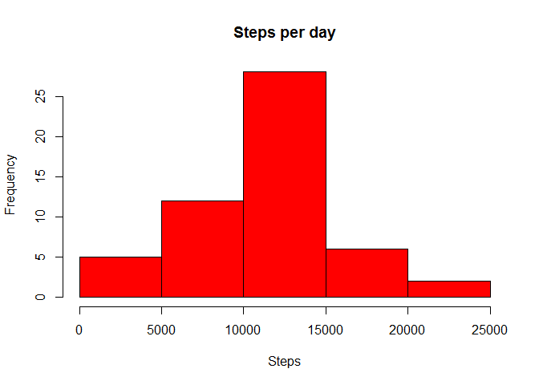
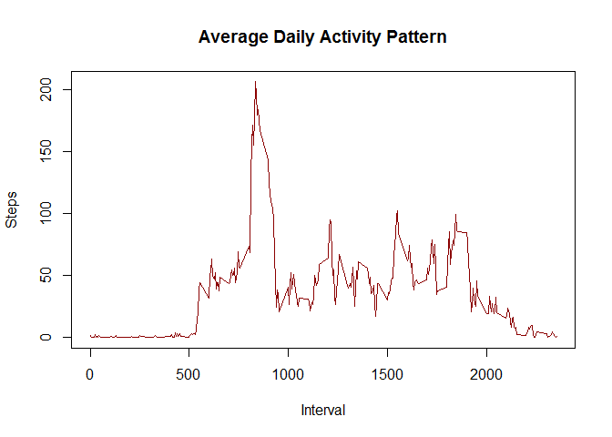
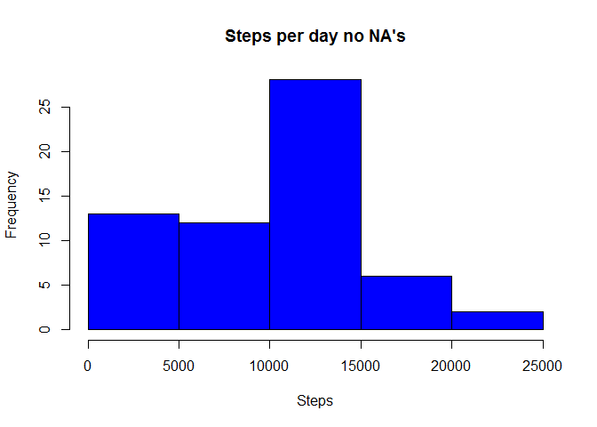
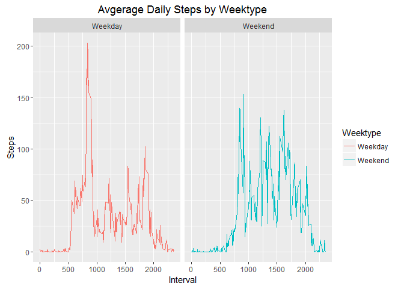

# Reproducible Research: Peer Assessment 1


## Loading and preprocessing the data


```r
library(ggplot2)
```

```
## Warning: package 'ggplot2' was built under R version 3.3.1
```

```r
knitr::opts_chunk$set(echo = TRUE)
monitoringData<-read.csv(unz("activity.zip", "activity.csv"),col.names = c("steps","date","interval"),na.strings = NA)
monitoringData[,2]<-as.data.frame(strptime(monitoringData[,2],format = "%Y-%m-%d"))
aggregateStepsByDay<-aggregate(steps ~ date, monitoringData, sum)
aggregateStepsByDayAndInterval<-aggregate(steps ~  interval, monitoringData, mean)
```

```r
hist(aggregateStepsByDay$steps,
        xlab = "Steps",
        col="red",
        main = "Steps per day"
   )
```

<!-- -->

```r
meanSteps<-mean(aggregateStepsByDay$steps)
medianSteps<-median(aggregateStepsByDay$steps)

## What is mean total number of steps taken per day?
print(paste("Mean of Steps per day:",meanSteps))
```

```
## [1] "Mean of Steps per day: 10766.1886792453"
```

```r
print(paste("Median of Steps per day:",medianSteps))
```

```
## [1] "Median of Steps per day: 10765"
```

```r
## What is the average daily activity pattern?

plot( aggregateStepsByDayAndInterval$interval,
         aggregateStepsByDayAndInterval$steps,
          ylab = "Steps",
          type = "l",
          xlab="Interval",
          main = "Average Daily Activity Pattern",
         col="darkred"
    )
```

<!-- -->

```r
aggregateStepsByDayAndInterval[which.max(aggregateStepsByDayAndInterval$steps),]
```

```
##     interval    steps
## 104      835 206.1698
```

```r
nrow(monitoringData[is.na(monitoringData$steps),])
```

```
## [1] 2304
```

```r
## Imputing missing values

monitoringDataNoNAs<-monitoringData
monitoringDataNoNAs[is.na(monitoringDataNoNAs)]<-0

nrow(monitoringDataNoNAs[is.na(monitoringDataNoNAs$steps),])
```

```
## [1] 0
```

```r
noNAaggregageStepsByDay<-aggregate(steps ~ date, monitoringDataNoNAs, sum)


 hist(noNAaggregageStepsByDay$steps,
        xlab = "Steps",
        col="blue",
        main = "Steps per day no NA's"
   )
```

<!-- -->

```r
noNAmeanSteps<-mean(noNAaggregageStepsByDay$steps)
noNAmedianSteps<-median(noNAaggregageStepsByDay$steps)
print(paste("Mean of Steps per day:",noNAmeanSteps))
```

```
## [1] "Mean of Steps per day: 9354.22950819672"
```

```r
print(paste("Median of Steps per day:",noNAmedianSteps))
```

```
## [1] "Median of Steps per day: 10395"
```

```r
#yes there is a difference after imputing the dataset.


## Are there differences in activity patterns between weekdays and weekends?

Weektype<-as.factor(ifelse(weekdays(monitoringDataNoNAs$date)=="Saturday" | weekdays(monitoringDataNoNAs$date)=="Sunday","Weekend","Weekday"))

names(Weektype)<-"Weektype"

newNoNaDataSet<-cbind(monitoringDataNoNAs,Weektype)

stepsByDayType<-aggregate(steps ~ interval + Weektype, newNoNaDataSet, mean)

ggplot(stepsByDayType, aes(interval,steps, color = Weektype)) +
        geom_path() +  
        facet_grid(. ~ Weektype ) +
        labs(x="Interval", y="Steps", title="Avgerage Daily Steps by Weektype")
```

<!-- -->

```r
## yes even though there is a higher peak of activity  during weekday the overall activity on weekend
## is more than the weekday.
```
